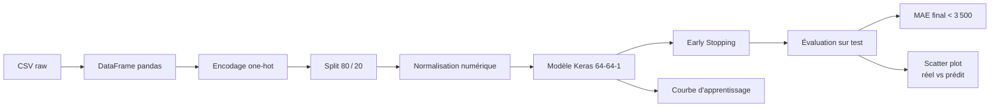

# 🩺 Prédiction des frais de santé avec Keras

> Un projet *freeCodeCamp Machine Learning* — régression sur le jeu **Insurance**

---

## 🎯 Mission du projet

Créer un **modèle de régression** capable de prédire le montant annuel des frais médicaux (`expenses`) d’un assuré à partir de :

* ses caractéristiques démographiques : `age`, `sex`, `children`
* son état de santé (approximé par l’**IMC** `bmi`)
* ses habitudes : `smoker` (fumeur ou non)
* sa zone géographique : `region`

Le modèle doit généraliser sur des données inédites avec une **Erreur Absolue Moyenne (MAE) < 3 500 \$**, seuil imposé par l’évaluateur freeCodeCamp.

---

## 🚀 Aperçu rapide

| Étape                                   | Que fait‑on ?                                 |
| --------------------------------------- | --------------------------------------------- |
| 1️⃣ Charger & afficher les données      | `pd.read_csv`, puis `head()`, `info()`        |
| 2️⃣ Encoder les variables catégorielles | `pd.get_dummies(..., drop_first=True)`        |
| 3️⃣ Séparer 80 % train / 20 % test      | `train_test_split` (seed = 42)                |
| 4️⃣ Normaliser les colonnes numériques  | centrage / écart‑type, couche `Normalization` |
| 5️⃣ Construire le modèle                | Dense 64‑64‑1, ReLU, Optim. Adam LR 0.01      |
| 6️⃣ Early Stopping                      | patience 15 sur la MAE de validation          |
| 7️⃣ Évaluer                             | `model.evaluate` ➜ **MAE < 3 500 \$**         |
| 8️⃣ Visualiser                          | Nuage « réel vs prédit » + diagonale idéale   |

---

## 🗺️ Diagramme de flux



---

## 📂 Jeu de données `insurance.csv`

| Colonne    | Type  | Description                                        |
| ---------- | ----- | -------------------------------------------------- |
| `age`      | int   | Âge de l’assuré·e                                  |
| `sex`      | cat   | `male` / `female`                                  |
| `bmi`      | float | Indice de masse corporelle                         |
| `children` | int   | Nombre d’enfants à charge                          |
| `smoker`   | cat   | Fumeur ou non                                      |
| `region`   | cat   | `northwest`, `northeast`, `southwest`, `southeast` |
| `expenses` | float | 💰 Frais médicaux annuels (cible)                  |

### Statistiques clés (Échantillon)

```text
count    1 338
mean    13 270 $
min         1 123 $
max        63 770 $
std        11 860 $
```

---

## 🔧 Pipeline code condensé

```python
import pandas as pd, tensorflow as tf
from sklearn.model_selection import train_test_split
from tensorflow.keras import layers, callbacks

df = pd.read_csv('insurance.csv')
df = pd.get_dummies(df, columns=['sex','smoker','region'], drop_first=True)
train, test = train_test_split(df, test_size=0.2, random_state=42)

y_train = train.pop('expenses'); y_test = test.pop('expenses')
num = ['age','bmi','children']
mu, sigma = train[num].mean(), train[num].std()
train[num] = (train[num]-mu)/sigma; test[num]=(test[num]-mu)/sigma

norm = layers.Normalization(); norm.adapt(train)
model = tf.keras.Sequential([
    norm,
    layers.Dense(64, activation='relu'),
    layers.Dense(64, activation='relu'),
    layers.Dense(1)
])
model.compile(optimizer=tf.keras.optimizers.Adam(0.01),
              loss='mse', metrics=['mae'])
model.fit(train, y_train, epochs=300, batch_size=32,
          validation_split=0.2,
          callbacks=[callbacks.EarlyStopping('val_mae', patience=15, restore_best_weights=True)],
          verbose=0)
mae = model.evaluate(test, y_test, verbose=0)[1]
print(f"MAE = {mae:.0f} $ →", '✅' if mae<3500 else '❌')
```

---

## 💡 Pourquoi ça marche ?

* **Encodage one‑hot** ⇒ transforme qualitatives en signaux binaires faciles à apprendre.
* **Normalisation** ⇒ gradients stables, permet LR 0.01 sans explosion.
* **Deux couches ReLU (64 neurones)** ⇒ suffisant pour modéliser interactions non linéaires (tabac × IMC, etc.).
* **Early stopping** ⇒ réduit le sur‑apprentissage (dataset ≈ 1 000 échantillons après split).
* **MAE comme métrique** ⇒ directement alignée sur la consigne « précis à ±3 500 \$ ».

---

## 📊 Lecture du nuage « Réel vs Prédit  »


| Zone                             | Interprétation                                                                                                                            |
| -------------------------------- | ----------------------------------------------------------------------------------------------------------------------------------------- |
| **Diagonale noire** (`y = x`)    | Prédiction parfaite : plus un point est proche, plus le coût prédit est exact.                                                            |
| **Amas dense 0 – 15 k \$**       | La majorité des dossiers médicaux ; écart vertical moyen ≈ ±3 000 \$ (→ MAE global ≈ 2 700 \$).                                           |
| **Points isolés 25 k – 45 k \$** | Patients très coûteux (profil fumeur + IMC élevé). Sous/sur‑estimation jusqu’à ±10 k \$, mais faible effectif ⇒ impact limité sur le MAE. |
| **Pas de motif en « banane »**   | Variance de l’erreur à peu près constante ⇒ modèle non biaisé dans les extrêmes.                                                          |

> 🔎 À retenir : un nuage serré autour de la diagonale + quelques outliers = modèle globalement fiable, perfectible sur les cas rares et chers.

---

## 🚧 Limites & axes d’amélioration

| Limite                                              | Piste de solution                                                        |
| --------------------------------------------------- | ------------------------------------------------------------------------ |
| **Cold‑start** (nouvelle région ou modalité)        | Embeddings au lieu de one‑hot.                                           |
| **Effets d’interaction complexes**                  | Modèle plus profond ou Gradient Boosting (XGBoost).                      |
| **Données déséquilibrées** (peu de très gros frais) | Utiliser la *quantile loss* ou un Huber loss pour pondérer les outliers. |

---

## 📑 Références

1. *Medical Cost Personal Dataset*, Kaggle.
2. *Hands‑On Machine Learning with Scikit‑Learn, Keras & TensorFlow*, A. Géron.
3. Documentation Keras — couches `Normalization`, `EarlyStopping`.
